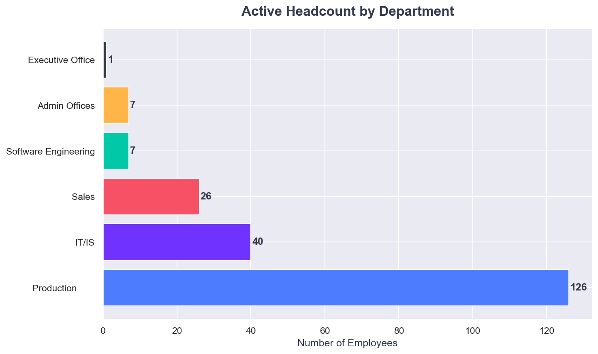
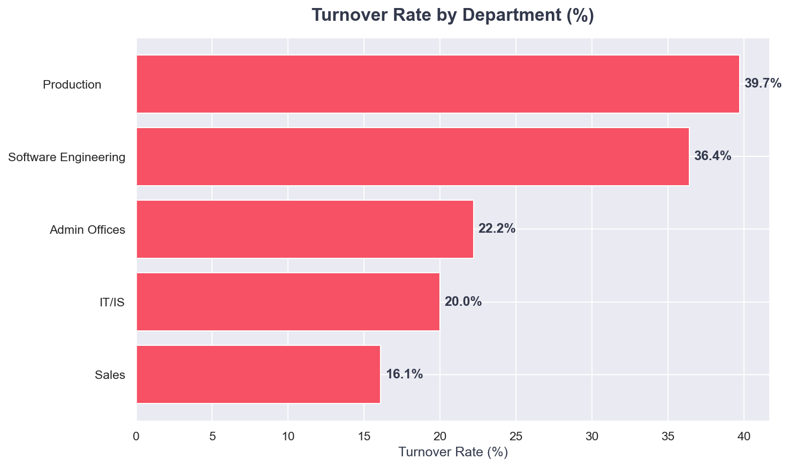
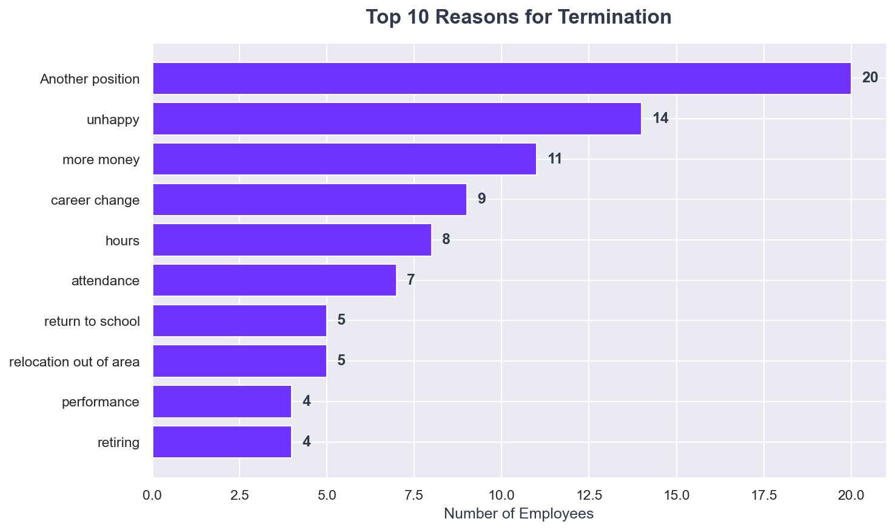
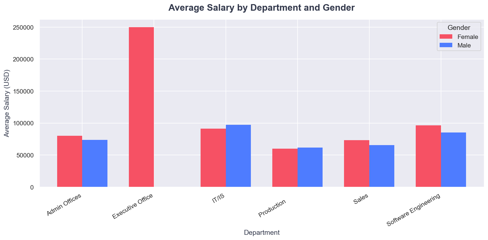
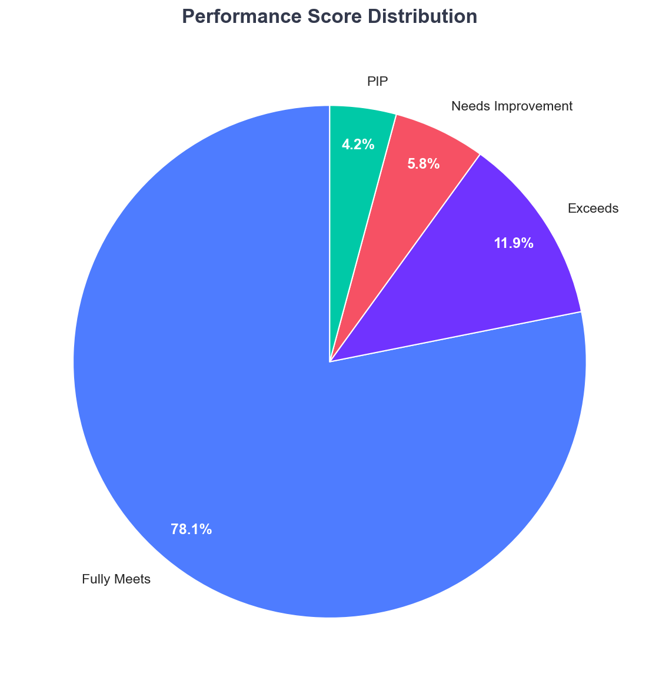
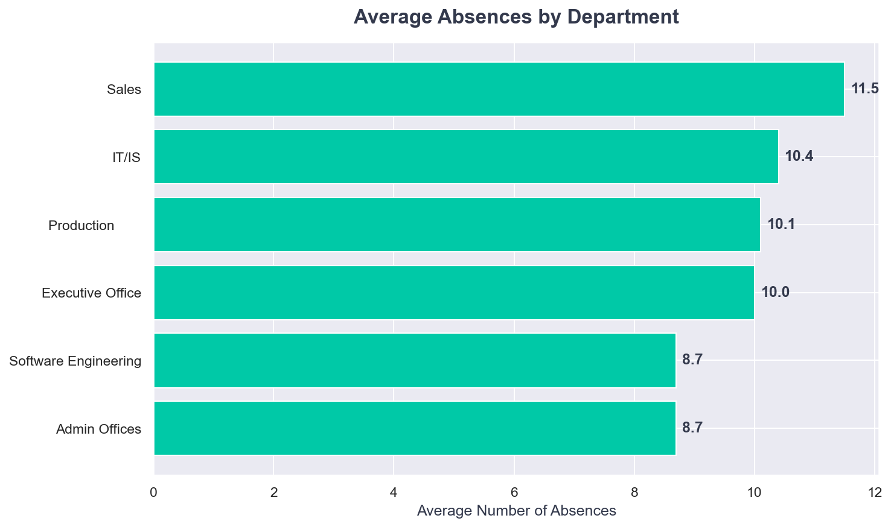
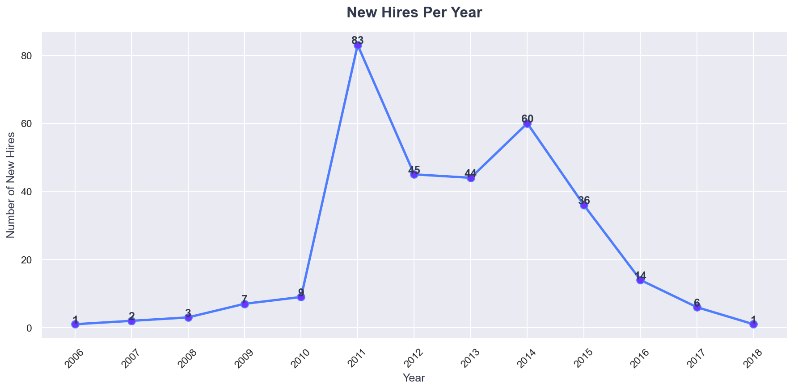

# SA HR Labour Analysis — Python

> End-to-end data analysis project using Python (Pandas, Matplotlib, Seaborn)
> to analyse HR workforce data — uncovering turnover patterns, salary equity,
> performance distribution, and hiring trends.

---

## Project Overview

This project applies Python data analysis techniques to a real HR dataset of
311 employees, producing 7 visualisations and a summary of key workforce
insights. The analysis covers the full data pipeline — loading, cleaning,
exploration, visualisation, and insight generation.

---

## Key Insights Found

| Metric | Finding |
|---|---|
| Total Employees | 311 |
| Active Employees | 207 |
| Terminated Employees | 104 |
| Overall Turnover Rate | 33.4% |
| Average Active Salary | $70,694 |
| Top Termination Reason | Another position |
| Highest Turnover Department | Production |

---

## Charts Produced

### 1. Active Headcount by Department


### 2. Turnover Rate by Department


### 3. Top Termination Reasons


### 4. Average Salary by Department and Gender


### 5. Performance Score Distribution


### 6. Average Absences by Department


### 7. New Hires Per Year


---

## Tech Stack

| Tool | Usage |
|---|---|
| Python 3.13 | Core language |
| Pandas | Data loading, cleaning, analysis |
| Matplotlib | Chart creation |
| Seaborn | Visual styling |
| Jupyter Notebook | Interactive analysis environment |

---

## Analysis Structure

sa-labour-analysis/
├── sa_labour_analysis.ipynb   # Full analysis notebook
├── HRDataset_v14.csv          # Dataset (311 employees, 36 columns)
├── chart1_headcount.png
├── chart2_turnover.png
├── chart3_termination_reasons.png
├── chart4_salary_gender.png
├── chart5_performance.png
├── chart6_absences.png
├── chart7_hiring_trend.png
└── README.md

---

## How to Run

1. Clone the repository:
```bash
git clone https://github.com/zondi11/sa-labour-analysis.git
```

2. Install dependencies:
```bash
pip install pandas matplotlib seaborn jupyter openpyxl
```

3. Open the notebook:
```bash
jupyter notebook sa_labour_analysis.ipynb
```

4. Run all cells from top to bottom.

---

## Author

**Sithembele Zondi**
BCom IS&T · BCom Honours in Information systems and technology — UKZN
Microsoft Certified: Power BI Data Analyst Associate

- 📧 sithezondi19@gmail.com
- 🔗 [LinkedIn](https://www.linkedin.com/in/sithembele-zondi)
- 🐙 [GitHub](https://github.com/zondi11)